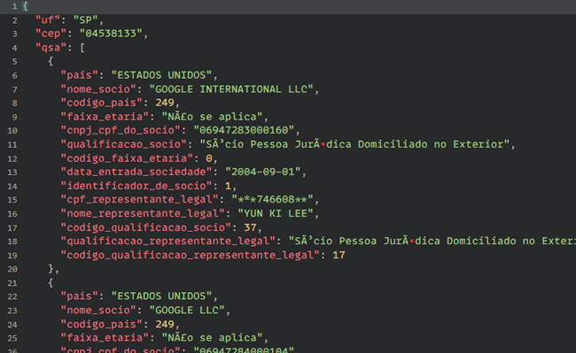

# Redirect request

Redireciona uma request para um cliente com acesso. semelhante ao tunelamento "ngrok".


#### Como rodar o servidor?

Você pode tanto compilar uma versão, ou pode utilizar um pre-build também que vou deixar disponível pra windows e linux(caso queira rodar no mac, ai só compilando, não tenho mac 🥹).

1. Precisa do V(linguagem V)
2. Necessário ter o git
3. Caso esteja no linux ou similar precisa instalar o gcc + openssl se for windows basta o gcc


<br/>

### **● Windows | Instalar a linguagem V**

Baixar o gcc como compilador, mas pode se usr o clang, msvc ou o tcc que já vem com o vlang, mas vamos usar o gcc pra melhores otmizações.

Acessar [WinLibs - GCC+MinGW-w64 compiler for Windows](https://winlibs.com/) e baixar o melhor pra você acredito que será o UCRT. Após descompactar adicionar a pasta bin ao path da variável de ambiente do windos.

ou pode usar o TDMGCC que não precisa configurar nada, apenas instalar.

Após tudo configurado, vamos baixar a linguagem e compilar.

```bash
git clone https://github.com/vlang/v.git
cd v
make -gcc
./v symlink
v version
```

se caso apareceu a versão, então ocorreu tudo bem!

<br/>

### **● Linux | Instalar a linguagem V**

```bash
sudo apt-get update && sudo apt-get upgrade
sudo apt install build-essential checkinstall zlib1g-dev -y
sudo apt install git
git clone https://github.com/vlang/v.git
cd v
make -gcc
./v symlink
v version
```

se caso apareceu a versão, então ocorreu tudo bem!

<br/><br/>

### **Compilando o **Redirect request**.**

```bash
git clone https://github.com/ldedev/Redirect_request.git
```


## Compilando e executando o servidor

```bash
cd Server-Redirect
v -prod .

./Server-Redirect
```

*Por padrão a porta configurada no arquivo "access.ini" é a 4060, mas pode colocar uma outra e executar o app*

<br/>

## Compilando e executando o middleware

```bash
cd Middleware-Redirect
v -prod .

./Middleware-Redirect
```

*Por padrão a porta configurada no arquivo "access.ini" é a 4062 para o end-point, mas pode colocar uma outra e executar o app*

<br/>

## Vamos testar

Vamos bater em um end-point do brasilapi.com.br pra pegar informação de cnpj.

O endpoint é esse -> brasilapi.com.br/api/cnpj/v1/{cnpj}

Eu coloquei o servidor em uma instância da aws, e liberei a porta 4060, e vou colocar o middleware em um pc qualquer.

<br/>

Vamos configurar o middleware com a porta 80, porque é a porta padrão de qualquer servidor e o id_context pode ser qualquer valor numérico:

```ini
[conf]
id_context=73373

[server-redirect]
ip=54.174.94.190
port=4060

#  06.990.590/0001-23 -> CNPJ do google
[endpoint-redirect]
ip=brasilapi.com.br
port=80
```

<br/><br/>

Agora que o servidor já está em execução na aws, vamos executar o middleware,

Se a seguinte menssagem apareceu, então ta tudo ok!

```
Middleware started! (54.174.94.190:4060/73373?) <- ● -> (brasilapi.com.br:80)
```

Vamos bater na seguinte url "**54.174.94.190:4060/73373?**" com o end-point do **brasilapi.**

*Como o método é **GET**, pode ser pelo navegador mesmo.*



Se retornou algo parecido com isso! então sucesso!

*E sim, o acentos não estão pegando, vou resolver isso depois, porque esse projeto é uma prova de conceito!*

<br/><br/>


# Porque estou brincando com esse projeto??

A nivél de simplificação vou chama-lo de RR.

*Esta é uma prova de conceito, por isso que não estou usando os melhores métodos nem uma boa organização, a media que corre o projeto vou melhorando*

Esse projeto é pra resolver um tipo de problema. Ele não é genérico o suficiente pra resolver tudo, e vou contar o motivo da criação.

Atualmente na empresa que trabalho temos um app(de garçom), que se conecta com app servidor no pc, pra servir o app com dados do nosso PDV.

> *o nosso produto é de food service 🥞*

Agora pensa, e como faremos pra nos conectar ao pc, quando estamos fora da rede?

:: Bem, VPN. E realmente é o que usamos hoje! Porém é lenta, tem o custo(não tenho tanta certeza quanto a isso) e muito instável.

Eu gosto da ideia de VPN, pois é bem seguro, mas...

Nessas ultimas semanas, tivemos algumas falhas com a vpn em relação ao app.

Então tirei três dias das minhas férias(*que começaram 15/08/2022*) pra fazer isso, infelizmente não dá pra testar em full funcionamento(porque estou de férias 😭 ansioso pra testar😖!).

Depois trago atualizações...
